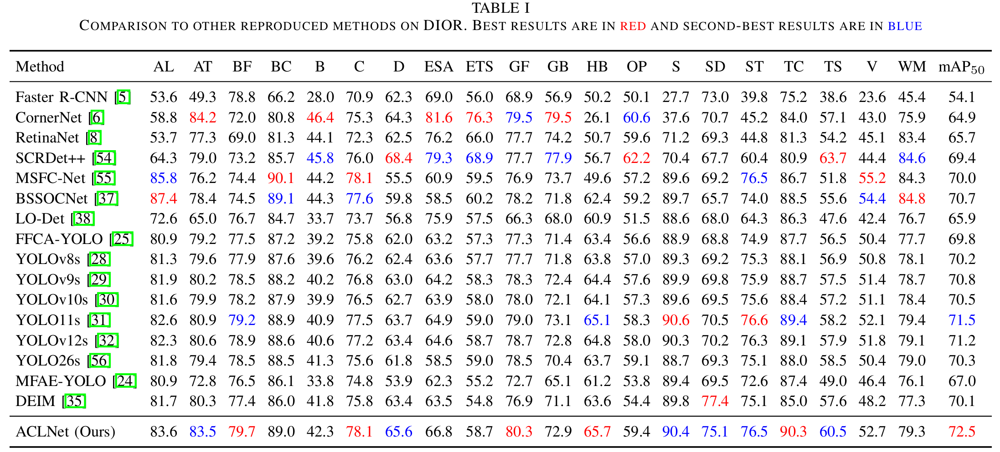
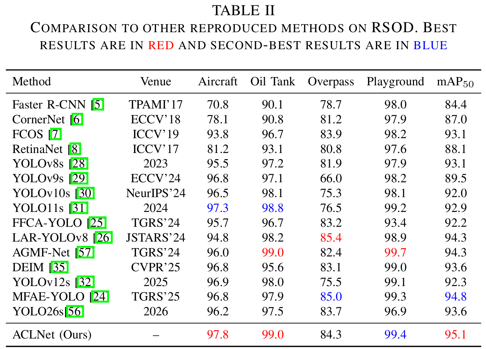
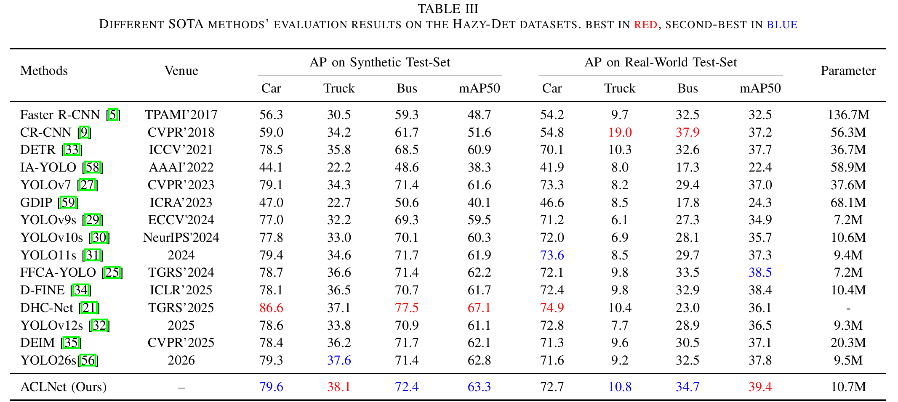
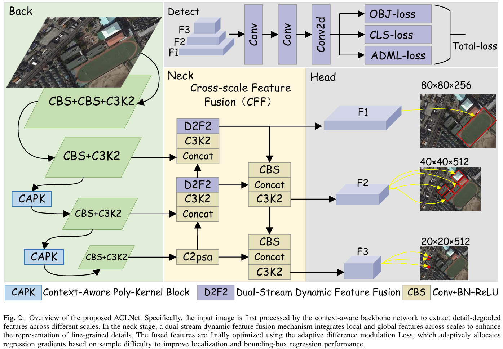

# ACLNet
**Adaptive Context-Aware Localization Network for Remote Sensing Object Detection Under Haze and Class Imbalance**

## 📖 Introduction
Object detection in optical remote sensing imagery is severely challenged by haze degradation and long-tailed category imbalance. These factors result in blurred appearances, noise interference, and frequent missed detections of minority classes. 

To address these issues, we propose **ACLNet**, a context-aware feature-enhancement and adaptive-localization-optimization framework tailored for robust remote sensing object detection. ACLNet consistently outperforms state-of-the-art methods across multiple datasets while remaining highly efficient.

## ✨ Key Features
* **Context-Aware Poly-Kernel (CAPK) Module:** Enhances mid- to high-level feature representations via parallel multi-kernel modelling and axial context modulation to compensate for haze-induced detail loss.
* **Dual-Stream Dynamic Feature Fusion (D2F2):** Dynamically fuses local structural cues with global dependencies to improve cross-scale alignment and discriminative consistency in complex scenes.
* **Adaptive Discrepancy-Modulated Localization (ADML) Loss:** Suppresses noisy gradients while adaptively emphasising medium-quality and hard samples, enhancing localization stability without increasing inference overhead.
* **High Efficiency:** The model is highly deployable with only 10.7M parameters and achieves a rapid inference speed of 125.28 FPS.

## 📊 Performance Benchmark
ACLNet has been extensively evaluated on three representative public benchmarks:


* **DIOR Dataset:** Achieves **72.5%** mAP50, outperforming mainstream YOLO variants and recent specialized methods.


* **RSOD Dataset:** Achieves **95.1%** mAP50 in high-density small-object scenarios.


* **Hazy-Det Dataset:** Demonstrates strong robustness under degradation, achieving **63.3%** mAP50 on the Synthetic Test Set and **39.4%** mAP50 on the Real-World Test Set.


## 🚀 Getting Started

### 1. Prerequisites
```bash
# Clone the repository
git clone [https://github.com/AmorFatio/ACLNet.git](https://github.com/AmorFatio/ACLNet.git)
cd ACLNet

# Install dependencies
pip install -r requirements.txt
```

### 2. Data Preparation
Please download the datasets and organize them into the `datasets/` directory:
* DIOR
* RSOD
* Hazy-Det

### 3. Training
```bash
# Train ACLNet on DIOR dataset
python train.py --config configs/aclnet_dior.yaml --batch-size 16 --epochs 300
```

### 4. Evaluation
```bash
# Evaluate the trained model
python val.py --weights runs/train/exp/weights/best.pt --data data/dior.yaml
```

## 🖼️ Architecture
`)

## 🎓 Citation

```
